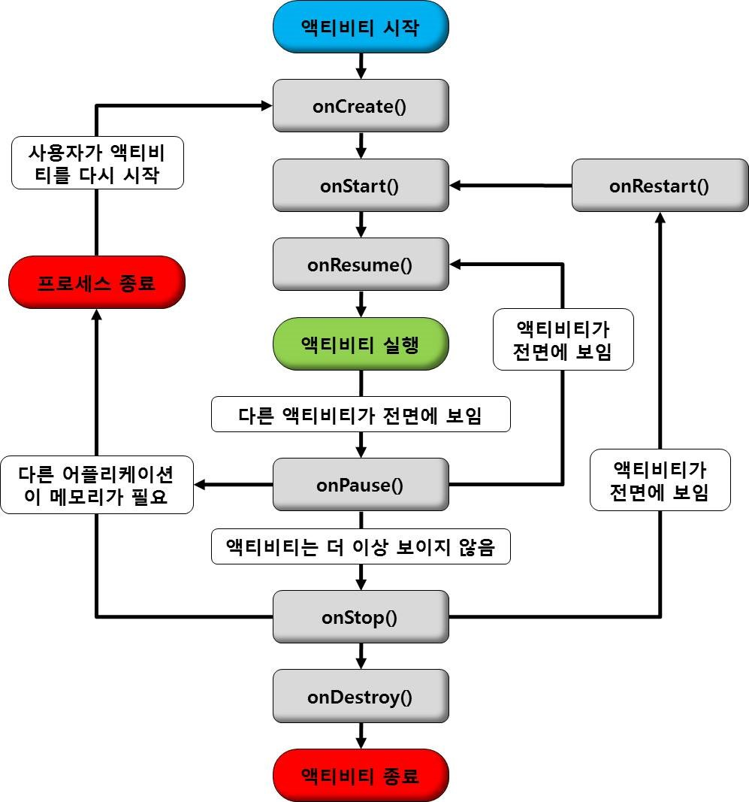

# Activity의 life cycle

> Activity는 사용자에 의해서 이벤트가 발생되면 그 상태가 변하며, 그에 따라 callback method가 호출된다.

1. Activity는 class 상태로 존재한다

2. activity가 화면에 나타나려면 일단 객체화가 되어야 한다( instance화 )

3. onCreate() method가 callback 된다 => 화면구성을 주로 한다

4. onStart() method가 callback 된다 => activity의 초기화 작업들은 한다

5. activity가 foreground로 나타나면서 사용자와 interaction이 가능

6. onResume() method가 callback 된다

7. activity의 상태가 Running상태가 된다

8. activity의 일부분이 보이지 않는 상태가 될 수 있다 ( Pause 상태 )

9. Pause상태가 되면 onPause() method가 callback 된다

10. activity의 전체가 완전히 가려져서 보이지 않는 상태가 된다 ( Stop 상태 )

11. Stop 상태가 되면 onStop() method가 callback 된다

12. 만약 Stop 상태에서 다시 Running 상태가 되면 

13. onRestart() -> onStart() -> onResume() 순서로 다시 호출

14. 사용하고 있는 activity를 종료하게 되면 Killed 상태로 진입

15. 집입하기 전에 onDestroy() method를 callback

