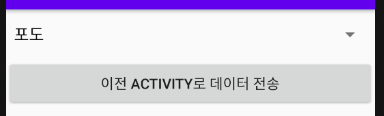
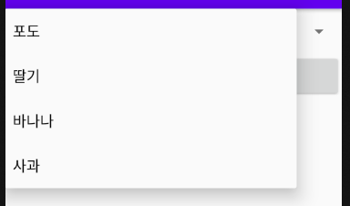

## Receive Data (Activity <- new Activity)

#### 1. Layout & 결과 



2번 Activity에 Spinner 생성.



Spinner 목록에서 전달할 Data값 선택.

"이전 ACTIVITY로 데이터 전송" 버튼 클릭하여 선택한 Data값 1번 Activity로 전달.


1번 Activity에서 토스트(Toast)로 전달받은 값 팝업.


#### 2. 코드

▼ xml layout 파일

```xml
<?xml version="1.0" encoding="utf-8"?>
<LinearLayout xmlns:android="http://schemas.android.com/apk/res/android"
    android:layout_width="match_parent"
    android:layout_height="match_parent"
    android:orientation="vertical">
	
    <!--여기서는 Spinner만 생성하고 Data값은 Activity 파일에서 생성-->
    <Spinner
        android:layout_width="match_parent"
        android:layout_height="wrap_content"
        android:id="@+id/mySpinner" />
    <Button
        android:layout_width="match_parent"
        android:layout_height="wrap_content"
        android:text="이전 Activity로 데이터 전송"
        android:id="@+id/sendDataBtn" />

</LinearLayout>
```


▼ java Activity 파일 ( 1번 Activity )

```java
public class MainActivity extends AppCompatActivity {
	@Override
    protected void onCreate(Bundle savedInstanceState) {
        super.onCreate(savedInstanceState);
        setContentView(R.layout.activity_main);
        
        Button _07_DataFromBtn = (Button)findViewById(R.id._07_DataFromBtn);
        _07_DataFromBtn.setOnClickListener(new View.OnClickListener(){
            @Override
            public void onClick(View v) {
                ComponentName cname =
                        new ComponentName("com.example.androidlectureexample", "com.example.androidlectureexample.Example07_DataFromActivity");
                Intent i = new Intent();
                i.setComponent(cname);

                // 새로 생성되는(2번) activity로부터 데이터를 받아오기 위한 용도
                // 2번 activity가 finish() 되는 순간 데이터를 받아온다
                startActivityForResult(i, 3000);
                // requestCode = 3000 저장
            }
        });
    }
    
    // 2번 Activity가 finish()된 후에 onActivityResult() method가 실행된다.
    @Override
    protected void onActivityResult(int requestCode, 
                                    int resultCode, @Nullable Intent data) {
        super.onActivityResult(requestCode, resultCode, data);
        if(requestCode == 3000 && resultCode == 7000){
            String msg = (String) data.getExtras().get("resultValue");
            Toast.makeText(this,msg,Toast.LENGTH_SHORT).show();
        }
    }
}
```


▼ java Activity 파일 ( 2번 Acitivity )

```java
public class Example07_DataFromActivity extends AppCompatActivity {

    private String result;

    @Override
    protected void onCreate(Bundle savedInstanceState) {
        super.onCreate(savedInstanceState);
        setContentView(R.layout.activity_example07_data_from);

        // Spinner안에 표현될 데이터를 만든다
        final ArrayList<String> list = new ArrayList<String>();
        list.add("포도");
        list.add("딸기");
        list.add("바나나");
        list.add("사과");

        // Spinner의 reference를 획득
        Spinner spinner = (Spinner)findViewById(R.id.mySpinner);
        // Adapter 생성 (Adapter의 종류는 Array외에 다양하다)
        ArrayAdapter adapter = new ArrayAdapter<>(getApplicationContext(),
                android.R.layout.simple_spinner_dropdown_item, list);
        // Adapter를 Spinner에게 부착
        spinner.setAdapter(adapter);

        // Spinner의 Event 처리
        spinner.setOnItemSelectedListener(new AdapterView.OnItemSelectedListener() {
            @Override // Spinner에서 선택된 값 result에 저장.
            public void onItemSelected(AdapterView<?> parent, 
                                       View view, int position, long id) {
                result = list.get(position);
            }

            @Override
            public void onNothingSelected(AdapterView<?> parent) {
                // 이 경우 처리 안함
            }
        });
		
        // Button Event 처리
        Button sendDataBtn = (Button)findViewById(R.id.sendDataBtn);
        sendDataBtn.setOnClickListener(new View.OnClickListener(){
            @Override
            public void onClick(View v) {
                Intent returnIntent = new Intent();
                returnIntent.putExtra("resultValue", result);
                setResult(7000, returnIntent); // resultCode = 7000 저장
                Example07_DataFromActivity.this.finish();
            }
        });
    }
}

```

