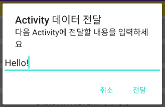

## Send Message (Activity -> new Activity)

#### 1. Layout & 결과 


1번 Activity에서 버튼 클릭 시 AlertDialog 생성.



Alert창에 Text 입력하여 2번 Activity에 값 전달.


2번 Activity에서 전달 받은 값 출력.


#### 2. 코드

▼ xml layout 파일

```xml
<?xml version="1.0" encoding="utf-8"?>
<LinearLayout xmlns:android="http://schemas.android.com/apk/res/android"
    android:layout_width="match_parent"
    android:layout_height="match_parent"
    android:orientation="vertical">
    
	// 전달 받은 값 출력할 TextView 태그
    <TextView
        android:layout_width="match_parent"
        android:layout_height="wrap_content"
        android:textSize="30pt"
        android:textColor="@color/colorPrimaryDark"
        android:background="@color/colorYellow"
        android:id="@+id/msgTv" />
    <Button
        android:layout_width="match_parent"
        android:layout_height="wrap_content"
        android:text="Activity 종료"
        android:id="@+id/closeBtn" />

</LinearLayout>
```


▼ java Activity 파일 ( 1번 Activity )

```java
Button _06_SendMessageBtn = (Button)findViewById(R.id._06_SendMessageBtn);
_06_SendMessageBtn.setOnClickListener(new View.OnClickListener(){
    @Override
    public void onClick(View v) {
        // alert창(dialog)를 이용해서 문자열을 입력받고
        // 입력받은 문자열을 다음 activity로 전달

        // 사용자가 문자열을 입력할 수 있는 widget 생성
        final EditText edittext = new EditText(MainActivity.this);
        // AlertDialog 생성
        AlertDialog.Builder builder =
            new AlertDialog.Builder(MainActivity.this);
        builder.setTitle("Activity 데이터 전달");
        builder.setMessage("다음 Activity에 전달할 내용을 입력하세요");
        builder.setView(edittext);
        builder.setPositiveButton("전달", new DialogInterface.OnClickListener() {
            @Override
            public void onClick(DialogInterface dialog, int which) {
                // 전달을 눌렀을 때 수행되는 이벤트 처리작업
                Intent i = new Intent();
                ComponentName cname = new ComponentName("com.example.androidlectureexample", "com.example.androidlectureexample.Example06_SendMessageActivity");
                i.setComponent(cname);
                // 데이터를 전달해서 activity를 시작
                i.putExtra("sendMSG", edittext.getText().toString()); 
                // 키와 벨류값으로 전달
                startActivity(i);
            }
        });
        builder.setNegativeButton("취소", new DialogInterface.OnClickListener() {
            @Override
            public void onClick(DialogInterface dialog, int which) {
                // 취소버튼은 처리 필요 없다
            }
        });
        builder.show();
    }
});
```


▼ java Activity 파일 ( 2번 Acitivity )

```java
package com.example.androidlectureexample;

import androidx.appcompat.app.AppCompatActivity;

import android.content.Intent;
import android.os.Bundle;
import android.view.View;
import android.widget.Button;
import android.widget.TextView;

public class Example06_SendMessageActivity extends AppCompatActivity {

    @Override
    protected void onCreate(Bundle savedInstanceState) {
        super.onCreate(savedInstanceState);
        setContentView(R.layout.activity_example06_send_message);

        // XML에 정의되어 있는 component의 reference를 획득
        TextView tv = (TextView)findViewById(R.id.msgTv);
        Button closeBtn = (Button)findViewById(R.id.closeBtn);

        // 현재 Activity에게 전달된 Intent를 획득
        Intent i = getIntent();
        String msg = (String) i.getExtras().get("sendMSG");
        tv.setText(msg);

        closeBtn.setOnClickListener(new View.OnClickListener(){
            @Override
            public void onClick(View v) {
                Example06_SendMessageActivity.this.finish();
            }
        });
    }
}

```

