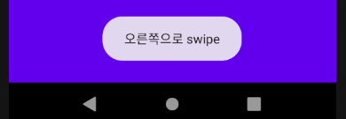
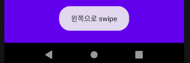

## Swipe Event 처리

#### 1. Layout & 결과 



화면 터치 시 토스트(Toast) 팝업 생성




#### 2. 코드

▼ xml layout 파일

```xml
<?xml version="1.0" encoding="utf-8"?>
<LinearLayout xmlns:android="http://schemas.android.com/apk/res/android"
    android:layout_width="match_parent"
    android:layout_height="match_parent"
    android:background="@color/colorPrimary"
    android:orientation="vertical"
    android:id="@+id/myLinearlayout"> <!-- id 값 -->
</LinearLayout>
```

LinearLayout 태그에 id값을 준다.


▼ java Activity 파일

```java
package com.example.androidlectureexample;

import androidx.appcompat.app.AppCompatActivity;

import android.annotation.SuppressLint;
import android.os.Bundle;
import android.util.Log;
import android.view.MotionEvent;
import android.view.View;
import android.widget.LinearLayout;
import android.widget.Toast;

public class Example05_SwipeEventActivity extends AppCompatActivity {

    double x1, x2; // 필드에 좌표값 생성

    @Override
    protected void onCreate(Bundle savedInstanceState) {
        super.onCreate(savedInstanceState);
        setContentView(R.layout.activity_example05_swipe_event);
		
        // LinearLayout객체에 대한 reference 받기
        LinearLayout ll = (LinearLayout)findViewById(R.id.myLinearlayout);
        ll.setOnTouchListener(new View.OnTouchListener(){
            @Override
            public boolean onTouch(View v, MotionEvent event) {
                String msg = ""; // 지역변수

                if(event.getAction() == MotionEvent.ACTION_DOWN){
                    x1 = event.getX();
                }
                if(event.getAction() == MotionEvent.ACTION_UP){
                    x2 = event.getX();
                    if(x1 < x2){
                        msg = "오른쪽으로 swipe";
                    } else {
                        msg = "왼쪽으로 swipe";
                    }
                    Toast.makeText(Example05_SwipeEventActivity.this,
                            msg, Toast.LENGTH_SHORT).show();
                }
                return true;
            }
        });
    }
}
```

MotionEvent.ACTION_DOWN 은 화면을 누를 때의 값이고, 그 때의 X좌표 값을 x1에 저장.

MotionEvent.ACTION_UP 은 화면에서 땔 때의 값이고, 그 때의 X좌표 값을 x2에 저장.


makeText() 함수로 Toast 만들고 show() 함수로 Toast 출력.

