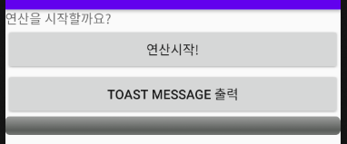
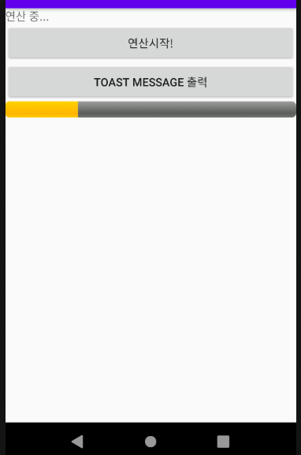
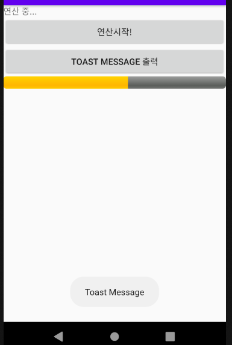
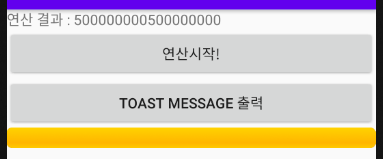

## Thread & Handler

#### 1. Layout & 결과



"연산시작" 버튼을 클릭하여 시간이 오래걸리는 1번 로직을 수행.



연산 진행 상황은 노란색으로 채워지는 ProgressBar를 통해 보여지고,

1번 로직이 처리되는 중에 "TOAST MESSAGE 출력" 버튼을 클릭하여 2번 로직 수행.



Thread를 통해 1번 로직이 처리되는 중에 Toast Message를 출력하는 2번 로직이 실행된다.



연산 작업하는 1번 로직 끝.


#### 2. 코드

▼ xml layout 파일

```xml
<?xml version="1.0" encoding="utf-8"?>
<LinearLayout xmlns:android="http://schemas.android.com/apk/res/android"
    android:layout_width="match_parent"
    android:layout_height="wrap_content"
    android:orientation="vertical">

    <TextView
        android:layout_width="match_parent"
        android:layout_height="wrap_content"
        android:text="연산을 시작할까요?"
        android:id="@+id/sumTv3" />
    <Button
        android:layout_width="match_parent"
        android:layout_height="wrap_content"
        android:id="@+id/startBtn3"
        android:text="연산시작!" />
    <Button
        android:layout_width="match_parent"
        android:layout_height="wrap_content"
        android:id="@+id/secondBtn3"
        android:text="Toast Message 출력" />
    <!--연산 진행상황을 나타낼 ProgressBar-->
    <ProgressBar
        android:layout_width="match_parent"
        android:layout_height="wrap_content"
        android:id="@+id/counterProgress1"
        style="@android:style/Widget.ProgressBar.Horizontal"
        android:progress="0" />
</LinearLayout>
```


▼ java Activity 파일

```java
public class Example11_CounterLogHandlerActivity extends AppCompatActivity {

    @Override
    protected void onCreate(Bundle savedInstanceState) {
        super.onCreate(savedInstanceState);
        setContentView(R.layout.activity_example11_counter_log_handler);

        // TextView & ProgressBar 에 대한 reference 갖고오기
        final TextView tv = (TextView)findViewById(R.id.sumTv3);
        final ProgressBar pb = (ProgressBar)findViewById(R.id.counterProgress1);

        // 데이터를 주고받는 역할을 수행하는 Handler객체 생성
        // Handler 객체는 메시지를 전달하는 method와
        // 메시지를 전달받아서 로직처리하는 method 2개를 주로 사용
        @SuppressLint("HandlerLeak") final Handler handler = new Handler() {
            @Override
            public void handleMessage(@NonNull Message msg) {
                super.handleMessage(msg);
                // 받은 메시지를 이용해서 화면 처리
                Bundle bundle = msg.getData();
                String count = bundle.getString("count");
                pb.setProgress(Integer.parseInt(count));
                String result = bundle.getString("result");
                tv.setText(result);
            }
        };

        // 첫번째(연산 시작) 버튼을 클릭했을 떄 로직처리하는 Thread를 생성해서 실행
        Button startBtn = (Button)findViewById(R.id.startBtn3);
        startBtn.setOnClickListener(new View.OnClickListener(){
            @Override
            public void onClick(View v) {
                // Thread를 생성
                // Thread에게 Activity와 데이터 통신을 할 수 있는
                // handler객체를 전달해야 한다
                MySumThread runnable = new MySumThread(handler);
                Thread t = new Thread(runnable);
                t.start();
            }
        });

        // 두번째 버튼에 대한 reference 획득 & 이벤트 처리
        // Toast message 출력
        Button secondBtn = (Button)findViewById(R.id.secondBtn3);
        secondBtn.setOnClickListener(new View.OnClickListener(){
            @Override
            public void onClick(View v) {
                Toast.makeText(Example11_CounterLogHandlerActivity.this,
                        "Toast Message",
                        Toast.LENGTH_SHORT).show();
            }
        });
    }
}

// 연산을 담당하는 Thread를 위해 Runnable interface를 구현한 class
class MySumThread implements Runnable {
    private Handler handler;

    MySumThread(Handler handler){
        this.handler = handler;
    }

    @Override
    public void run() {
        // 숫자를 더해가면서 progressbar를 진행시키기
        long sum = 0;
        for(long i=1; i<=1000000000L; i++){
            sum += i;
            if(i % 10000000 == 0){
                long loop = i / 10000000;

                // Message를 만들어서 handler를 이용해서 Activity에게 메시지 전달
                // Bundle 객체 이용하여 전달할 값 넣기
                // putString(key 값, 전달 값)
                Bundle bundle = new Bundle();
                bundle.putString("count", String.valueOf(loop));
                if(loop == 100){
                    bundle.putString("result","연산 결과 : "+sum);
                } else {
                    bundle.putString("result","연산 중...");
                }
                // 이 Bundle을 가질 수 있는 Message객체를 생성
                Message msg = new Message();
                msg.setData(bundle);
                handler.sendMessage(msg);
            }
        }
    }
}
```


#### 3. Java Activity파일 코드 작성 순서

1. onCreate() method 작성

```java
@Override
protected void onCreate(Bundle savedInstanceState) {
    super.onCreate(savedInstanceState);
    setContentView(R.layout.activity_example11_counter_log_handler);

    // TextView & ProgressBar 에 대한 reference 갖고오기
    final TextView tv = (TextView)findViewById(R.id.sumTv3);
    final ProgressBar pb = (ProgressBar)findViewById(R.id.counterProgress1);

    // 데이터를 주고받는 역할을 수행하는 Handler객체 생성
    // Handler 객체는 메시지를 전달하는 method와
    // 메시지를 전달받아서 로직처리하는 method 2개를 주로 사용
    @SuppressLint("HandlerLeak") final Handler handler = new Handler() {
        @Override
        public void handleMessage(@NonNull Message msg) {
            super.handleMessage(msg);
            // 받은 메시지를 이용해서 화면 처리
        }
    };

    // 첫번째(연산 시작) 버튼을 클릭했을 떄 로직처리하는 Thread를 생성해서 실행
    Button startBtn = (Button)findViewById(R.id.startBtn3);
    startBtn.setOnClickListener(new View.OnClickListener(){
        @Override
        public void onClick(View v) {
            
        }
    });

    // 두번째 버튼에 대한 reference 획득 & 이벤트 처리
    // Toast message 출력
    Button secondBtn = (Button)findViewById(R.id.secondBtn3);
    secondBtn.setOnClickListener(new View.OnClickListener(){
        @Override
        public void onClick(View v) {
            Toast.makeText(Example11_CounterLogHandlerActivity.this,
                           "Toast Message",
                           Toast.LENGTH_SHORT).show();
        }
    });
}
```


2. 연산 처리할 Thread를 위해 MySumThread class 작성

```java
// 연산을 담당하는 Thread를 위해 Runnable interface를 구현한 class
class MySumThread implements Runnable {
    private Handler handler;
	
    // 생성자(Constructor)
    MySumThread(Handler handler){
        this.handler = handler;
    }

    @Override
    public void run() {
        // 숫자를 더해가면서 progressbar를 진행시키기
        long sum = 0;
        for(long i=1; i<=1000000000L; i++){
            sum += i;
            if(i % 10000000 == 0){
                long loop = i / 10000000;

                // Message를 만들어서 handler를 이용해서 Activity에게 메시지 전달
                // Bundle 객체 이용하여 전달할 값 넣기
                // putString(key 값, 전달 값)
                Bundle bundle = new Bundle();
                bundle.putString("count", String.valueOf(loop));
                if(loop == 100){
                    bundle.putString("result","연산 결과 : "+sum);
                } else {
                    bundle.putString("result","연산 중...");
                }
                // Bundle을 가질 수 있는 Message객체를 생성
                Message msg = new Message();
                msg.setData(bundle);
                // handler를 통해 msg 전달
                handler.sendMessage(msg);
            }
        }
    }
}
```


3. 첫번째 버튼 클릭 시 Thread를 생성하여 실행

```java
// 첫번째(연산 시작) 버튼을 클릭했을 떄 로직처리하는 Thread를 생성해서 실행
Button startBtn = (Button)findViewById(R.id.startBtn3);
startBtn.setOnClickListener(new View.OnClickListener(){
    @Override
    public void onClick(View v) {
        // Thread를 생성
        // Thread에게 Activity와 데이터 통신을 할 수 있는
        // handler객체를 전달해야 한다
        MySumThread runnable = new MySumThread(handler);
        Thread t = new Thread(runnable);
        t.start(); // Thread start
    }
});
```


4. 전달받은 Message를 handler에서 처리

```java
// 데이터를 주고받는 역할을 수행하는 Handler객체 생성
// Handler 객체는 메시지를 전달하는 method와
// 메시지를 전달받아서 로직처리하는 method 2개를 주로 사용
@SuppressLint("HandlerLeak") final Handler handler = new Handler() {
    @Override
    public void handleMessage(@NonNull Message msg) {
        super.handleMessage(msg);
        // 받은 메시지를 이용해서 화면 처리
        Bundle bundle = msg.getData();
        String count = bundle.getString("count");
        pb.setProgress(Integer.parseInt(count));
        String result = bundle.getString("result");
        tv.setText(result);
    }
};
```

