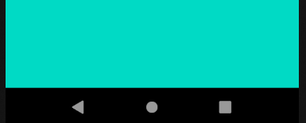
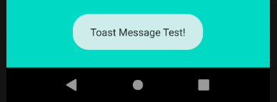

## Touch Event 처리

**1. Layout & 결과 **



화면 터치 시 토스트(Toast) 팝업 생성




**2. 코드**

```java
public class Example04_TouchEventActivity extends AppCompatActivity {

    @Override
    protected void onCreate(Bundle savedInstanceState) {
        super.onCreate(savedInstanceState);
        setContentView(R.layout.activity_example04_touch_event);
    }

    // onTouchEvent() method에는 Listener가 이미 부착되어 있다.
    @Override
    public boolean onTouchEvent(MotionEvent event) {
        // Toast message를 이용
        // makeText : static 메소드로서 인스턴트 없이 호출 가능
        Toast.makeText(this, "Toast Message Test!", Toast.LENGTH_SHORT).show();
        return super.onTouchEvent(event);
    }
}
```

Toast.makeText() 함수에서 첫번째 인자 this 는 현재의 Activity인 Example04_TouchEventActivity 클래스의 context정보를 나타낸다.

세번째 인자 Toast.LENGTH_SHORT 는 화면에 띄우는 시간을 나타내며 Toast.LENGTH_LONG 을 쓸 수도 있다.

makeText()로 Toast 만들고 뒤에 show() 함수를 사용하여 화면에 출력한다.


