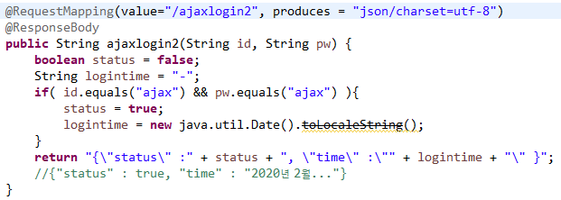
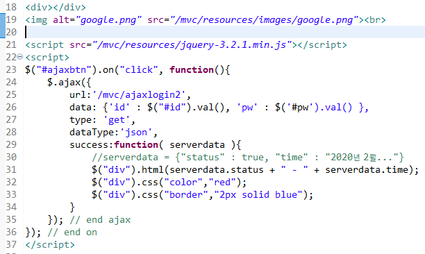

# AJAX

\>>>ajax는 통신방식이고 json 형식으로 주고받아야 한다.

| **ajax 클라이언트**  **$.ajax(**  **{**  **url: '/mvc/test'**  **data: {"id" :  "spring" }**  **type: 'get'**  **dataType:'json'   success:function(server){**  **server<=**  **"{\"status\":true}";**  **$("div").html**  **(server.status):**  **}**  **);** | **ajax 서버**  **@Controller**  **class A{**  **@RequestMapping("/test")**  **@ResponseBody   String a(String id){**  **//처리**  **//결과 응답**  **return  "{\"status\":true}";   }** |
| ------------------------------------------------------------ | ------------------------------------------------------------ |
|                                                              |                                                              |

