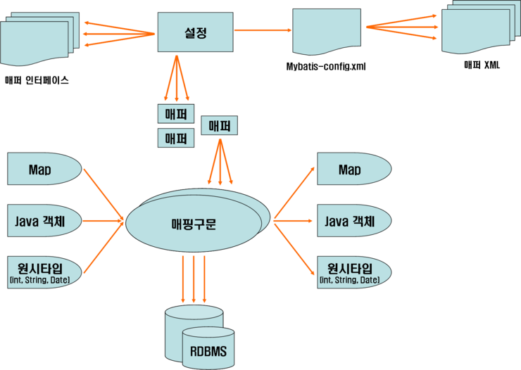

# SPRING

### DI (Dependency Injection : 의존성 주입)

### IOC (Inversion Of Control : 제어의 역전)

### AOP (Aspect Oriented Programming : 관점 지향 프로그래밍)

### MVC ()

spring MVC

singleton 패턴 / proxy 패턴 (aop)

---

### POJO

### Proxy

### Singleton / Factory

### Weaving

---

**SPRING FRMEWORK** 

1>자바 객체 생성 - 관리=bean - 삭제의 라이프 사이클 관리한다

2> bean의 의존성을 관리한다.(ioc , di)

3> AOP 기능 제공한다.

4> MVC 기능 제공한다.

5> dao, vo 등 기존 non-spring 환경에서도 사용하던 객체 그대로 사용 가능하다(스프링 라이브러리를 상속받거나 하지 않아도)

= pojo bean 사용 가능하다

(plain old java object)

6> spring dao 기능으로 db 연동 기능 제공한다.

7> 각종 다른 프레임워크 연동 기능 제공한다.

8> mybatis 프레임워크 연동 가능하다

= spring dao 기능 대신 사용하는 형태로 현재 개발 추세

 

9> spring 은 db 연결 기능으로

 

spring + jdbc

spring + spring dao

spring + mybatis 

=>환경이 가능하다.

 

 

**MYBATIS FRMEWORK** 

\- 객체지향 언어인 자바의 관계형 데이터 베이스 프로그래밍을 좀더 쉽게 할수 있게 도와주는 개발 프레임워크. 

\- 자바에선 데이터베이스 프로그래밍을 하기 위해 JDBC(자바에서 제공하는 데이터베이스 프로그래밍 API)를 제공

\- JDBC는 관계형 데이터 베이스를 사용하기 위해 다양한 API를 제공

\- JDBC는 코드 반복이 너무 많다는 단점이 있음

\- 처음에는 ibatis 라는 이름으로 시작 ->MYBATIS로 변경

\

* JDBC

\1. 코드 반복 많다 => db-config.xml 

\2. 자바 언어 내부에 sql 언어 포함 => sql-mapping.xml

\3. db 연결 복잡한 정보 매번 작성 => db-config.xml