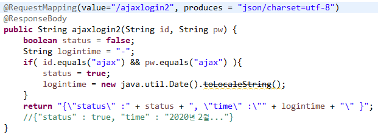
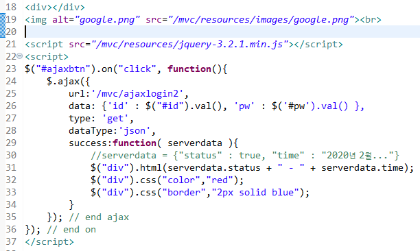

# WEB

> HTML 태그 : 구성요소
>
> CSS : 구성요소( 배치, 색상, 크기조정 )
>
> javascript / jquery : 구성요소 동적효과
>
> 위의 3가지 구성 ==> HTML5 

### GET / POST

#### GET 방식

\1. http:....login?name1=value1&name2=value2 >> ? 이전까지 URL로 인식

\2. url 뒤 요청 파라미터값 전송 방식

\3. 규칙 : url?변수명1=값1&

\4. 영문자 그대로 전송

\5. 특수문자나 한글 인코딩 전송

\6. url은 공백 포함하면 안된다.

\7. 웹서버 url 제한

#### POST

\1. (post 전송 값 보이지 않는다.) name1=value1&name2=value2 

\2. url 별도 분리

//3. 규칙 : url?변수명1=값1&

\4. 영문자 그대로 전송

\5. 특수문자나 한글 인코딩 전송

\7. 웹서버 url 전달 길이 무제한

\8. 파일 업로드, 암호 전송

\9. 코드

\>>>ajax는 통신방식이고 json 형식으로 주고받아야 한다.

| **ajax 클라이언트**  **$.ajax(**  **{**  **url: '/mvc/test'**  **data: {"id" :  "spring" }**  **type: 'get'**  **dataType:'json'   success:function(server){**  **server<=**  **"{\"status\":true}";**  **$("div").html**  **(server.status):**  **}**  **);** | **ajax 서버**  **@Controller**  **class A{**  **@RequestMapping("/test")**  **@ResponseBody   String a(String id){**  **//처리**  **//결과 응답**  **return  "{\"status\":true}";   }** |
| ------------------------------------------------------------ | ------------------------------------------------------------ |
|                                                              |                                                              |

